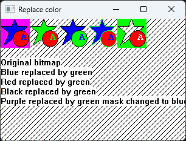

# How to replace a color in an HBITMAP



## Disclaimer
This code was written in 2002 for article on codeproject. 
I updated it in 2025 to compile in x64 with visual 2022 but no other change were made.
There are multiple implementations in the files to answer questions I received at time on CodeProject.

## Introduction

When I wrote this function my problem was to replace one color by another on transparent bitmaps. My images were resources bitmaps, which I store in an `ImageList` for easy transparency.

There is no easy way to directly access a bitmap's pixel on Win32. If you're interested in doing that, this article may help you understand the usage of `CreateDIBSection`.

*   If you have to load a bitmap from a resource and make many color replacements, or if you have to change a color in a `HBITMAP`, this function is for you.
*   If you have a bitmap in a resource and want to replace one or more colors on load, it's better to use `CreateMappedBitmap`. You can find in the sample program a `ReplaceColor` function which uses `CreateMappedBitmap`.

I've made the same code using only `BitBlt`. `BitBlt` is really fast but the creation of the mask bitmap is so slow that the whole function is twice slower than the code using `CreateDIBSection` (sources are in the sample).

## Limitations

My code always return a 32 bit bitmap. If you need to keep your original bitmap bit per pixels, you'll have two options:

*   You can rewrite it with `GetDIBits`. You will need special code for monochromes to 32 bit bitmaps.
*   You can `BitBlt` the 32 bit bitmap to your less color DC. It's easy, slow, and you will lose some colors in the process.

## Sample program

The sample program you can download does the following:

*   Creates a window in `WinMain`.
*   Loads a bitmap from resources `WM_NCCREATE`.
*   Adds this bitmap to an `ImageList` `WM_NCCREATE`.
*   Uses `ReplaceColor` to get a copy of the bitmap with one color replaced by another (4 times) `WM_NCCREATE`.
*   Displays all the stored images in the window `WM_PAINT`.
*   Cleans everything `WM_DESTROY`.

## Easy to use

A short sample of the usage of `ReplaceColor`:

```cpp
HBITMAP hBmp2 = LoadBitmap(g\_hinstance,MAKEINTRESOURCE(IDB\_SAMPLEBITMAP));
HBITMAP hBmp = ReplaceColor(hBmp2,0xff0000,0x00ff00); // replace blue by green
DeleteObject(hBmp2);

// Use your modified Bitmap here 
DeleteObject(hBmp);
```

## ReplaceColor source code

The `ReplaceColor` function is a pure Win32 function. It doesn't make any use of MFC. Its code is standalone, you can cut and paste it without modifications to your code.

```cpp
#define COLORREF2RGB(Color) (Color & 0xff00) | ((Color >> 16) & 0xff) \\
                                 | ((Color << 16) & 0xff0000)

//\-------------------------------------------------------------------------------
// ReplaceColor
//
// Author    : Dimitri Rochette drochette@coldcat.fr
// Specials Thanks to Joe Woodbury for his comments and code corrections
//
// Includes  : Only <windows.h>
//
// hBmp         : Source Bitmap
// cOldColor : Color to replace in hBmp
// cNewColor : Color used for replacement
// hBmpDC    : DC of hBmp ( default NULL ) could be NULL if hBmp is not selected
//
// Retcode   : HBITMAP of the modified bitmap or NULL for errors
//
//\-------------------------------------------------------------------------------
HBITMAP ReplaceColor (HBITMAP hBmp,COLORREF cOldColor,COLORREF cNewColor,HDC hBmpDC)
{
	HBITMAP RetBmp=NULL;
	if (hBmp)
	{	
		HDC BufferDC=CreateCompatibleDC(NULL);	// DC for Source Bitmap
		if (BufferDC)
		{
			HBITMAP hTmpBitmap = (HBITMAP) NULL;
			if (hBmpDC)
				if (hBmp == (HBITMAP)GetCurrentObject(hBmpDC, OBJ_BITMAP))
				{
					hTmpBitmap = CreateBitmap(1, 1, 1, 1, NULL);
					SelectObject(hBmpDC, hTmpBitmap);
				}
			HGDIOBJ PreviousBufferObject=SelectObject(BufferDC,hBmp);
			// here BufferDC contains the bitmap
			
			HDC DirectDC=CreateCompatibleDC(NULL);	// DC for working		
			if (DirectDC)
			{
				// Get bitmap size
				BITMAP bm;
				GetObject(hBmp, sizeof(bm), &bm);
				
				// create a BITMAPINFO with minimal initilisation for the CreateDIBSection
				BITMAPINFO RGB32BitsBITMAPINFO; 
				ZeroMemory(&RGB32BitsBITMAPINFO,sizeof(BITMAPINFO));
				RGB32BitsBITMAPINFO.bmiHeader.biSize=sizeof(BITMAPINFOHEADER);
				RGB32BitsBITMAPINFO.bmiHeader.biWidth=bm.bmWidth;
				RGB32BitsBITMAPINFO.bmiHeader.biHeight=bm.bmHeight;
				RGB32BitsBITMAPINFO.bmiHeader.biPlanes=1;
				RGB32BitsBITMAPINFO.bmiHeader.biBitCount=32;
				UINT * ptPixels;	// pointer used for direct Bitmap pixels access

				HBITMAP DirectBitmap= CreateDIBSection(DirectDC, (BITMAPINFO *)&RGB32BitsBITMAPINFO, DIB_RGB_COLORS,(void **)&ptPixels, NULL, 0);
				if (DirectBitmap)
				{
					// here DirectBitmap!=NULL so ptPixels!=NULL no need to test
					HGDIOBJ PreviousObject=SelectObject(DirectDC, DirectBitmap);
					BitBlt(DirectDC,0,0,bm.bmWidth,bm.bmHeight,BufferDC,0,0,SRCCOPY);					
					// here the DirectDC contains the bitmap

					// Convert COLORREF to RGB (Invert RED and BLUE)
					cOldColor=COLORREF2RGB(cOldColor);
					cNewColor=COLORREF2RGB(cNewColor);

					// After all the inits we can do the job : Replace Color
					for (int i=((bm.bmWidth*bm.bmHeight)-1);i>=0;i--)
					{
						if (ptPixels[i]==cOldColor) ptPixels[i]=cNewColor;
					}
					// little clean up
					// Don't delete the result of SelectObject because it's our modified bitmap (DirectBitmap)
					SelectObject(DirectDC,PreviousObject);
					
					// finish
					RetBmp=DirectBitmap;
				}
				// clean up
				DeleteDC(DirectDC);
			}			
			if (hTmpBitmap)
			{
				SelectObject(hBmpDC, hBmp);
				DeleteObject(hTmpBitmap);
			}
			SelectObject(BufferDC,PreviousBufferObject);
			// BufferDC is now useless
			DeleteDC(BufferDC);
		}
	}
	return RetBmp;
}
```